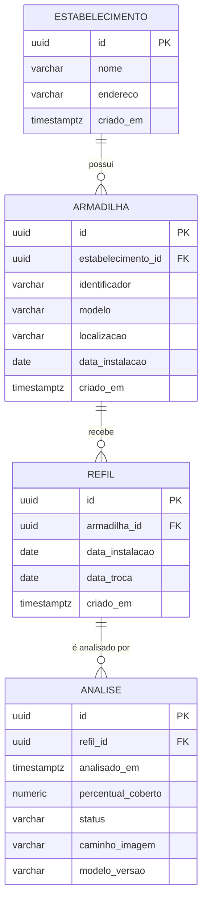

# DATA MODEL — Projeto Integrador

**Versão:** 1.0
**Status:** ATIVO
**Escopo:** modelo de dados, entidades, relacionamentos e regras de
persistência

---

# 1. Objetivo

Especificar o modelo de dados do projeto: entidades, atributos,
relacionamentos e regras de integridade.

---

# 2. Decisão: o banco entra no MVP

A especificação anterior tratava o banco como opcional, sob o argumento de que
o modelo roda de forma stateless. Essa decisão foi revista.

**Motivo:** uma imagem isolada informa apenas o estado atual da armadilha. O
valor de negócio descrito em `../foundation/proposta_individual.md` — permitir
que a empresa saiba quando visitar cada cliente — depende de **série
temporal**, não de leitura pontual. Sem histórico, o sistema é um
classificador de imagem; com histórico, é um sistema de monitoramento capaz de
projetar quando a armadilha saturará.

O custo é baixo: três tabelas no MVP.

---

# 3. Tecnologia

| Item | Escolha | Justificativa |
|---|---|---|
| Banco | PostgreSQL | Dados fortemente relacionais; tipo `timestamptz` adequado à série temporal; é o banco que seria usado em produção, alinhado à intenção de evoluir o projeto |
| Execução | Docker Compose | Elimina divergência de ambiente entre integrantes; instalação no Windows sem atrito |
| ORM | SQLAlchemy | Padrão da indústria Python, documentação vasta. O critério decisivo é prático: em projeto com prazo, qualquer erro tem resposta consolidada disponível |
| Migrations | Alembic | Integração nativa com SQLAlchemy |

## 3.1 Alternativas descartadas

| Alternativa | Motivo |
|---|---|
| SQLite | Atenderia o MVP, mas a migração posterior para PostgreSQL tem atrito real (divergência de tipos e sintaxe) e não sustenta acesso concorrente de múltiplos estabelecimentos |
| MongoDB | Os dados são fortemente relacionais e o volume é pequeno; NoSQL adicionaria complexidade sem resolver problema existente |
| Tortoise ORM | Sintaxe mais limpa e async nativo, mas comunidade pequena e documentação limitada — risco desnecessário sob prazo acadêmico |

## 3.2 Migrations desde a primeira tabela

Toda alteração de schema é feita via migration Alembic, desde a criação
inicial das tabelas — nunca por alteração manual no banco.

O motivo é o trabalho em grupo: sem migrations, um integrante adiciona uma
coluna localmente, o código dele funciona e quebra na máquina dos demais.
Adicionar migrations a um banco já existente é retrabalho evitável.

---

# 4. Escopo por fase

| Entidade | Papel | Fase |
|---|---|---|
| `armadilha` | Unidade física instalada | **MVP** |
| `refil` | Ciclo de vida de um refil, da instalação à troca | **MVP** |
| `analise` | Resultado de uma inferência do modelo | **MVP** |
| `estabelecimento` | Cliente onde as armadilhas estão instaladas | Fase 2 |

O `estabelecimento` está especificado abaixo para que o modelo fique completo,
mas sua implementação fica para a fase seguinte — cadastro multi-cliente não é
o foco do MVP.

---

# 5. Diagrama

---

# 6. Entidades

## 6.1 `estabelecimento` (Fase 2)

Cliente onde as armadilhas estão instaladas.

| Campo | Tipo | Regra |
|---|---|---|
| `id` | `uuid` | PK |
| `nome` | `varchar` | Obrigatório |
| `endereco` | `varchar` | Opcional |
| `criado_em` | `timestamptz` | Default `now()` |

## 6.2 `armadilha`

Unidade física instalada em um estabelecimento.

| Campo | Tipo | Regra |
|---|---|---|
| `id` | `uuid` | PK |
| `estabelecimento_id` | `uuid` | FK, nulo no MVP |
| `identificador` | `varchar` | Código legível para identificar a unidade em campo |
| `modelo` | `varchar` | Ex.: `StickFly K-45` |
| `localizacao` | `varchar` | Descrição do ponto de instalação |
| `data_instalacao` | `date` | |
| `criado_em` | `timestamptz` | Default `now()` |

## 6.3 `refil`

Ciclo de vida de um refil adesivo, da instalação até a troca.

**Esta é a entidade que sustenta a análise temporal.** Quando um refil é
trocado, o percentual de cobertura volta a zero. Sem separar os ciclos, a
série temporal de uma armadilha ficaria descontínua e sem sentido — seria
impossível responder "quanto tempo este refil levou para saturar".

| Campo | Tipo | Regra |
|---|---|---|
| `id` | `uuid` | PK |
| `armadilha_id` | `uuid` | FK, obrigatório |
| `data_instalacao` | `date` | Obrigatório |
| `data_troca` | `date` | Nulo enquanto o refil estiver ativo |
| `criado_em` | `timestamptz` | Default `now()` |

**Regra de integridade:** uma armadilha deve ter no máximo um refil ativo
(`data_troca IS NULL`) por vez.

## 6.4 `analise`

Resultado de uma inferência do modelo sobre uma imagem.

| Campo | Tipo | Regra |
|---|---|---|
| `id` | `uuid` | PK |
| `refil_id` | `uuid` | FK, obrigatório |
| `analisado_em` | `timestamptz` | Momento da inferência |
| `percentual_coberto` | `numeric(5,2)` | 0,00 a 100,00 |
| `status` | `varchar` | `ok`, `atencao` ou `trocar` |
| `caminho_imagem` | `varchar` | Caminho relativo do arquivo, não o binário |
| `modelo_versao` | `varchar` | Versão do modelo no formato `semver+hash` — ver seção 7.2 |

---

# 7. Regras de persistência

## 7.1 Armazenamento de imagens

As imagens **não** são armazenadas no banco. O campo `caminho_imagem` guarda
uma referência relativa a um diretório do sistema de arquivos.

Armazenar binários em PostgreSQL incha o banco, complica o backup e degrada a
performance de consultas que não precisam da imagem — que é a maioria.

**Localização:** `data/uploads/`, montado como **volume Docker** a partir do
host. O volume é obrigatório: arquivos gravados dentro do container são
perdidos quando ele é recriado.

**Retenção:** no MVP, todas as imagens são preservadas. Na escala do projeto
(dezenas de armadilhas, uma análise diária) o volume é irrelevante. Uma versão
de produção precisaria de política de expurgo, o que está fora deste escopo.

## 7.2 Rastreabilidade do modelo

O campo `analise.modelo_versao` é obrigatório e registra qual versão do modelo
produziu cada resultado.

Isso atende diretamente o princípio de reprodutibilidade definido em
`.context/rules/ai_development_rules.md`, seção 9.1. Sem esse campo, após um
retreino não haveria como distinguir resultados produzidos por modelos
diferentes, invalidando qualquer comparação histórica.

**Formato:** `semver+hash`, por exemplo `v1.2.0+a3f9c2e1`.

- O **semver** é definido manualmente e serve à comunicação — é o que aparece
  no relatório e nas discussões do grupo.
- O **hash** são os primeiros 8 caracteres do SHA-256 do arquivo de pesos,
  calculado automaticamente no carregamento do modelo.

A combinação existe porque cada parte cobre uma falha da outra: o semver
sozinho depende de alguém lembrar de incrementá-lo a cada retreino — se
esquecer, dois modelos distintos recebem a mesma identificação e o campo perde
a função. O hash sozinho é infalível, mas ilegível para discussão.

## 7.3 Derivação do status

O campo `status` é derivado de `percentual_coberto` segundo os limiares
definidos em `../foundation/project_overview.md`, seção 7.2. É persistido — e
não calculado sob demanda — justamente porque os limiares podem ser
recalibrados: uma análise deve preservar o status vigente no momento em que
foi feita.

---

# 8. Consultas que o modelo precisa sustentar

O schema foi desenhado para responder:

- Qual o estado atual de cada armadilha (última análise do refil ativo)?
- Quanto tempo este refil levou para saturar?
- Qual a taxa média de saturação por armadilha, em pontos percentuais por dia?
- Quais armadilhas devem ser visitadas nos próximos N dias, dada a taxa
  observada?

A última consulta é a que entrega o valor de negócio descrito na proposta.

---

# 9. Infraestrutura

Divisão entre o que roda em container e o que roda nativamente:

| Componente | Execução |
|---|---|
| PostgreSQL | Docker |
| Backend (FastAPI) | Docker |
| Frontend (React) | Docker |
| **Treino do modelo** | **Nativo ou Colab — fora do Docker** |

O treino fica fora do Docker deliberadamente: GPU passthrough via WSL2 no
Windows funciona, mas o esforço de configuração não se justifica. O treino é
um processo offline que produz um arquivo de pesos, e esse arquivo é montado
como volume no container do backend.

---

# 10. Decisões registradas

| Decisão | Escolha | Seção |
|---|---|---|
| Banco no MVP | Sim — `armadilha`, `refil`, `analise` | 2, 4 |
| SGBD | PostgreSQL em Docker | 3 |
| ORM | SQLAlchemy | 3 |
| Migrations | Alembic, desde a primeira tabela | 3.2 |
| Armazenamento de imagem | Filesystem em volume Docker, caminho no banco | 7.1 |
| Retenção de imagem | Preservar tudo no MVP | 7.1 |
| Formato de `modelo_versao` | `semver+hash` | 7.2 |
| Campo `metadados` (`jsonb`) | **Descartado** — ver abaixo | — |

## 10.1 Sobre o campo `metadados` descartado

Um campo `jsonb` genérico foi considerado para registrar dados adicionais do
modelo (tempo de inferência, confiança da máscara) sem exigir migration.

Foi descartado por representar abstração prematura, contrariando o princípio
de "preferir soluções simples a abstrações prematuras" das regras do projeto.
Campos genéricos tendem a acumular chaves não documentadas e se tornar
ilegíveis com o tempo.

Caso a necessidade se concretize durante a pesquisa, o campo apropriado é
adicionado via migration — que é exatamente o cenário para o qual as
migrations existem.

---

# 11. Pendências

Nenhuma pendência de decisão. Itens de implementação:

- [ ] Escrever a migration inicial das três tabelas do MVP
- [ ] Implementar cálculo do hash do arquivo de pesos no carregamento do
      modelo

---

# FIM DO DATA MODEL
