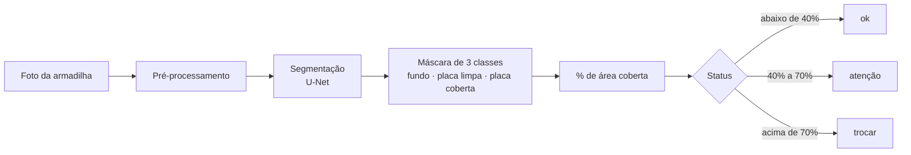

# Monitoramento de Armadilhas Adesivas com Visão Computacional

Sistema que analisa a foto de uma armadilha adesiva de mosquito, mede **quanto da superfície já está coberta por insetos** e indica **quando trocar o refil** — trocando a inspeção manual por um critério objetivo.

     

> Projeto Integrador de Sistemas Inteligentes III — Fatec "Shunji Nishimura", Pompeia. **Em desenvolvimento.**

## O problema

Empresas de controle de pragas mantêm armadilhas adesivas em mercados e açougues e decidem a troca do refil por **inspeção visual**, sem critério objetivo. O resultado é um custo duplo:

- **Troca antecipada:** deslocamento da equipe e refil descartado com vida útil sobrando;
- **Troca tardia:** armadilha saturada, sem eficácia no controle de pragas.

O problema foi levantado com uma empresa real do setor, parceira do projeto.

## A solução



Além da leitura pontual, o sistema guarda o histórico de cada armadilha e **estima em quantos dias ela vai saturar**, permitindo planejar a visita em vez de reagir a ela.

## Funcionalidades

- **Análise por imagem:** upload da foto, máscara de segmentação sobreposta, percentual de cobertura e status;
- **Dashboard operacional:** armadilhas ordenadas por urgência, com painel de alertas;
- **Histórico e projeção:** evolução da cobertura por refil e previsão de dias até a saturação por regressão linear;
- **Timelapse:** reprodução das imagens de um refil sincronizada com o gráfico de evolução;
- **Ciclo de vida do refil:** registro de trocas, com histórico de duração de cada ciclo.

## Decisões técnicas

| Decisão                                                                 | Por quê                                                                                                                          |
| ------------------------------------------------------------------------ | --------------------------------------------------------------------------------------------------------------------------------- |
| **Medir área coberta em vez de contar insetos**                   | Insetos colados se sobrepõem; área é um indicador mais robusto de saturação                                                  |
| **Segmentação em 3 classes** (fundo, placa limpa, placa coberta) | O percentual é calculado sobre a placa detectada, não sobre a imagem inteira; o resultado não depende do enquadramento da foto |
| **Dataset sintético primeiro, dados reais depois**                | Não existe base pública deste cenário; as máscaras nascem junto com a imagem, sem rotulagem manual                            |
| **Avaliação separada em sintético e real**                      | A distância entre as duas métricas mede o*domain gap* e diagnostica se o problema está no gerador ou no modelo               |
| **Baseline clássico (OpenCV) como comparação**                  | Mostra com evidência, e não por afirmação, onde o modelo treinado supera um limiar de brilho                                  |
| **Transfer learning** (U-Net com encoder ResNet34 pré-treinado)   | Viabiliza o treino com um dataset pequeno                                                                                         |
| **Projeção por regressão sobre todas as medições**            | Usar só a primeira e a última leitura amplifica o ruído de medição                                                           |

## Stack

| Camada         | Tecnologia                                                              |
| -------------- | ----------------------------------------------------------------------- |
| Modelo         | Python, PyTorch,`segmentation_models_pytorch`, OpenCV, Albumentations |
| Backend        | FastAPI, SQLAlchemy, Alembic                                            |
| Banco de dados | PostgreSQL                                                              |
| Frontend       | React, TypeScript, Vite, Tailwind CSS, Recharts                         |
| Infraestrutura | Docker, Docker Compose                                                  |
| Qualidade      | Ruff, testes automatizados                                              |

## Status

- [X] Especificação técnica completa (arquitetura, modelo, API, telas, avaliação)
- [X] Ambiente de desenvolvimento e infraestrutura com Docker
- [ ] Banco de dados e API
- [ ] Interface web
- [ ] Gerador de dataset sintético
- [ ] Treinamento e avaliação do modelo
- [ ] Validação com fotos reais da empresa parceira

Ainda não há resultados de modelo para reportar. Eles serão publicados aqui após a avaliação.

## Como executar

Pré-requisitos: Docker Desktop, Python 3.11+, [`uv`](https://docs.astral.sh/uv/) e Node.js LTS.

```bash
# variáveis de ambiente (preencha os placeholders)
cp .env.example .env
cp backend/.env.example backend/.env
cp frontend/.env.example frontend/.env

# dependências e lint do backend
cd backend
uv sync
uv run ruff check .
```

A aplicação completa ainda não sobe com `docker compose up`: o Postgres sobe, mas backend e frontend dependem de etapas em andamento.

## Documentação

A especificação completa do sistema está em [`.context/`](.context/): visão geral, modelo de dados, contrato da API, telas, pipeline do modelo e critérios de avaliação. O ponto de partida é [`.context/plan/README.md`](.context/plan/README.md).

## Autor

**Pedro Lucas Francisco** — Tecnologia em Sistemas Inteligentes, Fatec Pompeia.
